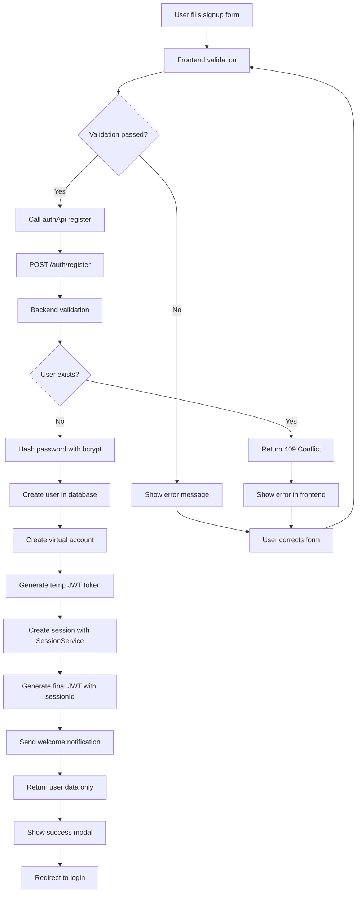
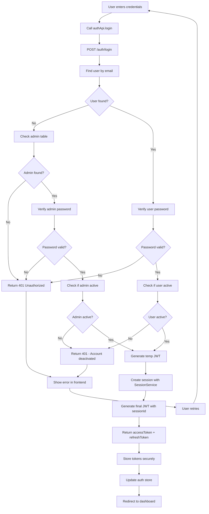
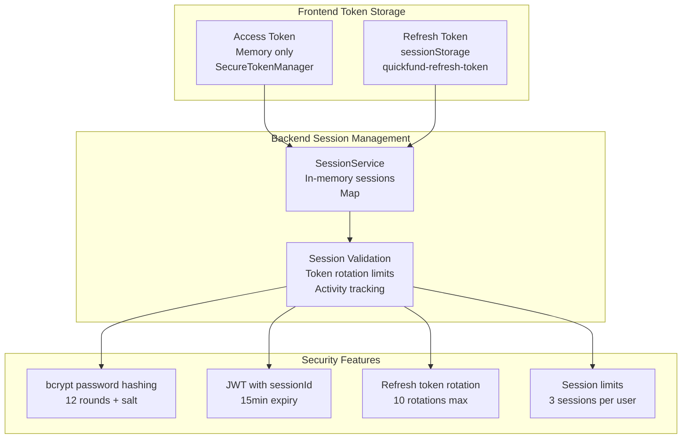
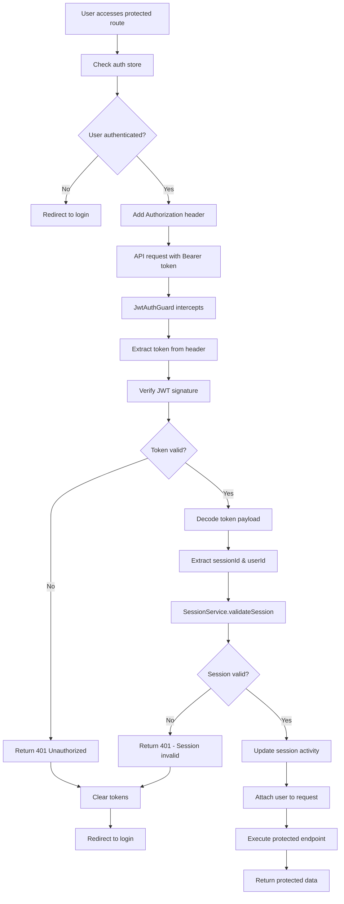
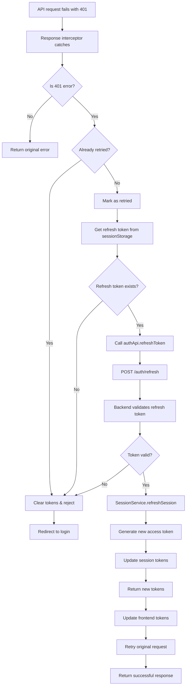
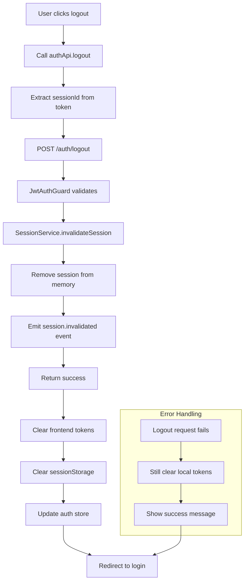
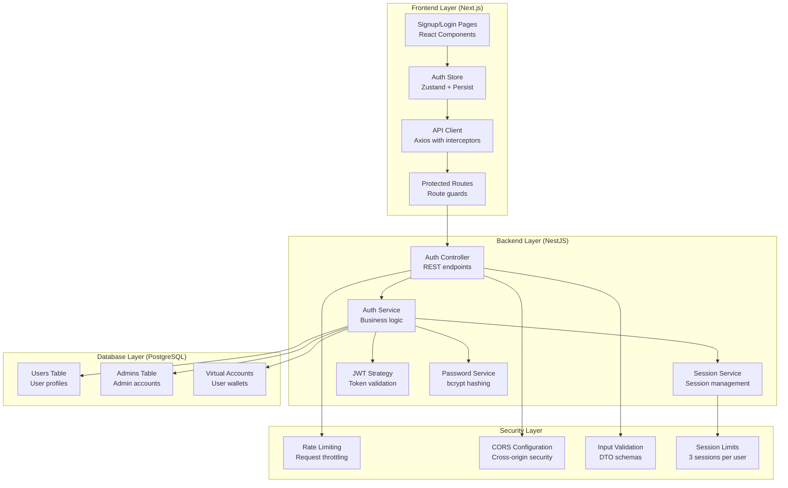
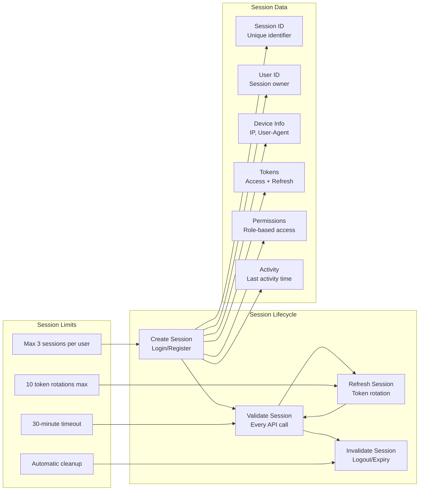
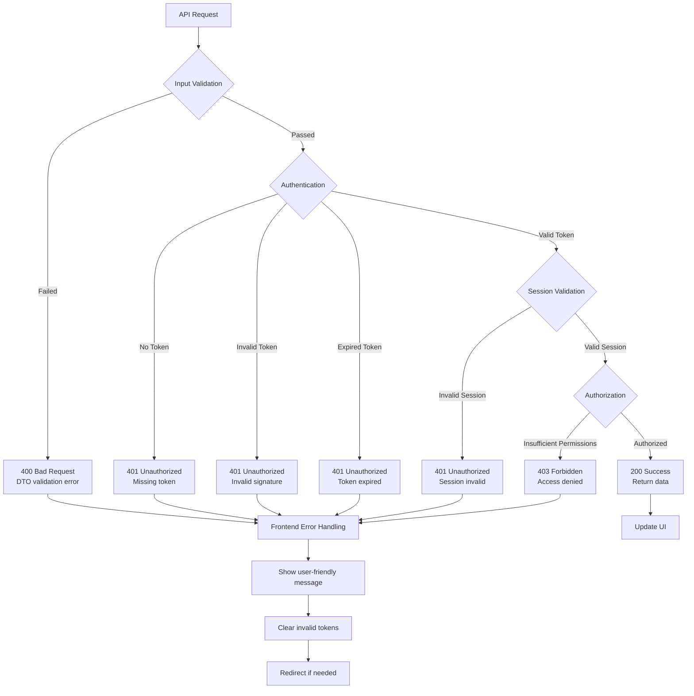

# QuickFund Authentication Flow - Actual Implementation

## 1. User Registration Flow

## 2. User Login Flow

## 3. Token Management & Security

## 4. Protected Route Access Flow

## 5. Token Refresh Flow

## 6. Logout Flow

## 7. System Architecture Overview

## 8. Session Management Details

## 9. Error Handling & Security

## Key Implementation Details

### **Frontend Security Features:**
- **Memory-only access tokens** - Stored in `SecureTokenManager` singleton
- **SessionStorage for refresh tokens** - More secure than localStorage
- **Automatic token refresh** - Via Axios response interceptors
- **Route protection** - Zustand auth store integration

### **Backend Security Features:**
- **Session-based authentication** - In-memory session management
- **Token rotation limits** - Max 10 rotations per session
- **Session limits** - Max 3 sessions per user
- **Automatic cleanup** - Expired sessions removed every 5 minutes
- **bcrypt password hashing** - 12 rounds with unique salt

### **API Security:**
- **JWT with sessionId** - Tokens include session identifier
- **CORS protection** - Cross-origin request restrictions
- **Rate limiting** - Request throttling per IP
- **Input validation** - DTO schemas for all endpoints

This implementation demonstrates enterprise-level security practices suitable for a senior developer role, with proper session management, token security, and comprehensive error handling. 