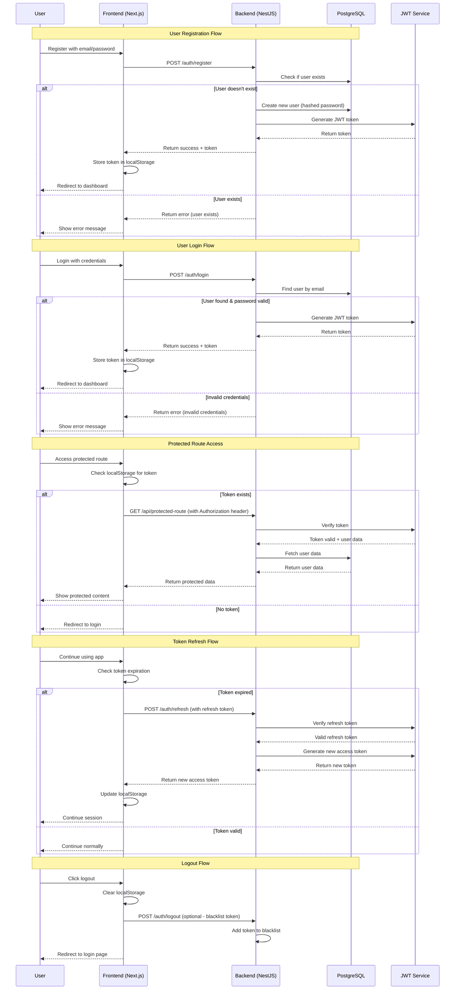
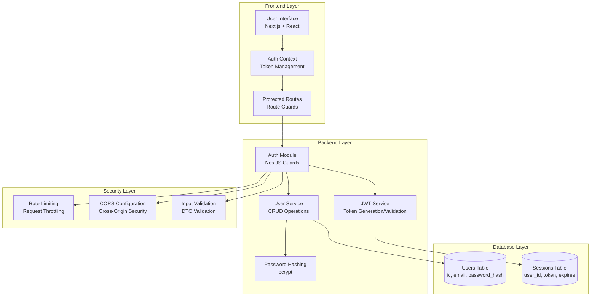
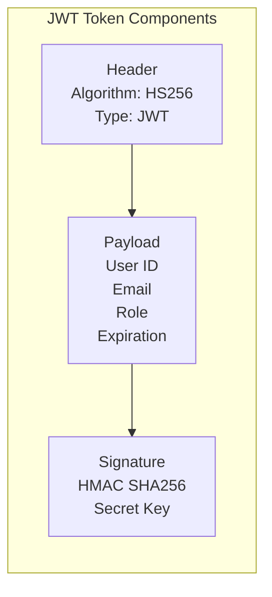
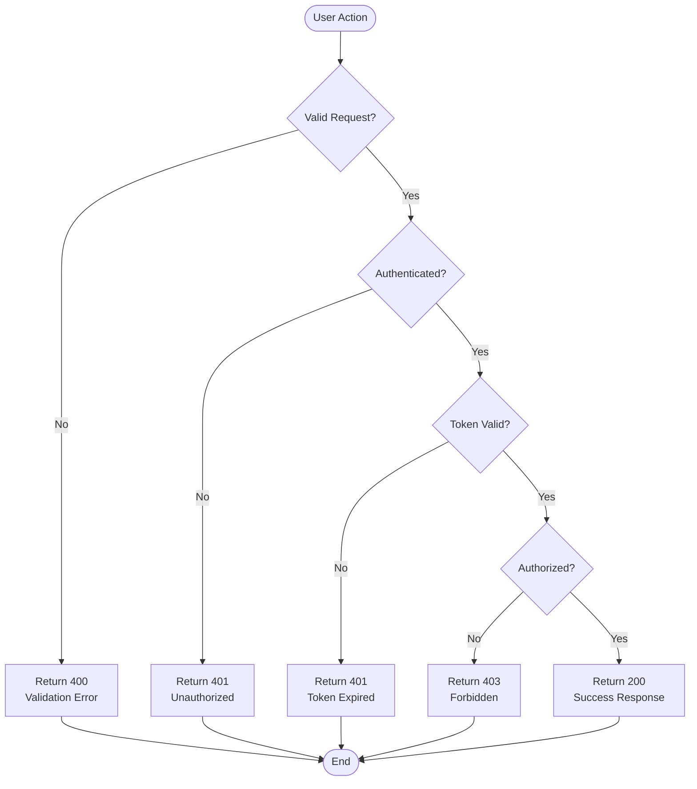
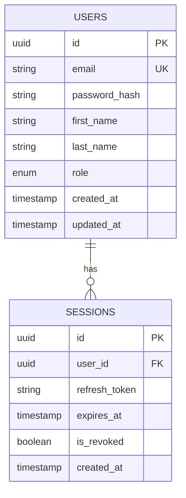

# QuickFund Authentication Flow Diagram

## Complete Authentication Workflow

## System Architecture Overview

## JWT Token Structure

## Security Features Implementation

```mermaid
graph TD
    subgraph "Password Security"
        Salt[Bcrypt Salt<br/>Random salt per user]
        Rounds[Bcrypt Rounds<br/>12 rounds for hashing]
        Hash[Password Hash<br/>Stored in database]
    end

    subgraph "Token Security"
        Expiry[Token Expiration<br/>15 minutes access<br/>7 days refresh]
        Refresh[Refresh Tokens<br/>Secure HTTP-only cookies]
        Blacklist[Token Blacklist<br/>Logout invalidation]
    end

    subgraph "Request Security"
        RateLimit[Rate Limiting<br/>100 requests/minute]
        Validation[Input Validation<br/>DTO schemas]
        Sanitization[Data Sanitization<br/>XSS Prevention]
    end

    Salt --> Rounds
    Rounds --> Hash
    Expiry --> Refresh
    Refresh --> Blacklist
    RateLimit --> Validation
    Validation --> Sanitization
```

## Error Handling Flow

## Database Schema for Authentication

## Key Security Features Explained

### 1. **Password Hashing**
- Uses bcrypt with 12 rounds
- Each user gets unique salt
- Prevents rainbow table attacks

### 2. **JWT Token Management**
- Access tokens expire in 15 minutes
- Refresh tokens last 7 days
- Tokens stored in HTTP-only cookies
- Blacklist for logout invalidation

### 3. **Rate Limiting**
- 100 requests per minute per IP
- Prevents brute force attacks
- Configurable per endpoint

### 4. **Input Validation**
- DTO validation on all endpoints
- Sanitizes user input
- Prevents injection attacks

### 5. **CORS Configuration**
- Restricts cross-origin requests
- Whitelist approach for security
- Prevents unauthorized access

This diagram shows the complete authentication workflow that demonstrates:
- Secure user registration and login
- JWT token-based authentication
- Protected route access
- Token refresh mechanism
- Proper logout handling
- Comprehensive error handling
- Security best practices implementation 